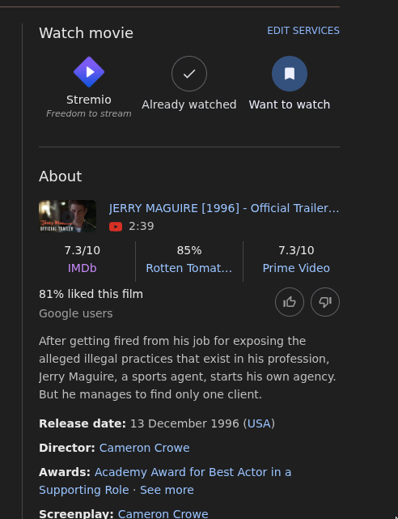
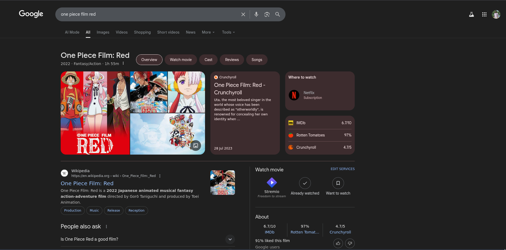
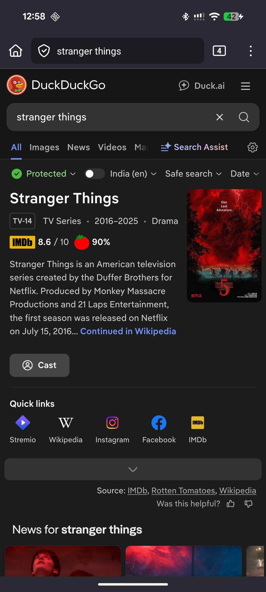

<h1 align="center">
  
   
  Stremio Google Search Extension
</h1>

  <strong>Adds the stremio button to watch now instead of the other streaming service to open up stremio directly from google/duckduckgo search
</strong>

## Features
* Supported Search Engines : Google, Duckduckgo
* Mobile support for firefox (chromium based browsers don't have extension support)
* Floating stremio icon in mobile if watch options section is not available.

## Installation
### Chrome - (Any chromium based browsers like brave,edge etc.)
* Goto Chrome and Click on customise at top right corner > Extension > Manage Extensions
* Enable Developer Mode
* Download the zip file for the project and extract it. [Download](https://github.com/athuld/stremio-google-search-extension/archive/refs/heads/main.zip)
* Click on Load unpacked and select the **chrome** folder inside the extracted folder
* You should now see the extension installed. Browse and Enjoy :)
### Firefox
* Install the addon from the firefox-addon store

## Video Tutorial
### Chrome

## Donate
* If anyone wants to help out publishing the extension in chrome store and also suppport.

## Screenshots

## Notes
* I made this for personal use since i always search my movies and series first and then watch it after checking reviews and scores etc..
* This extension currently only works for movies and series and some anime films which has that right side watch now panel
* Didn't publish this extension to webstore as it was asking for $5 for registation. Don't know if people use this extension lol ;)
* Any suggestion/edit are always welcome :)
